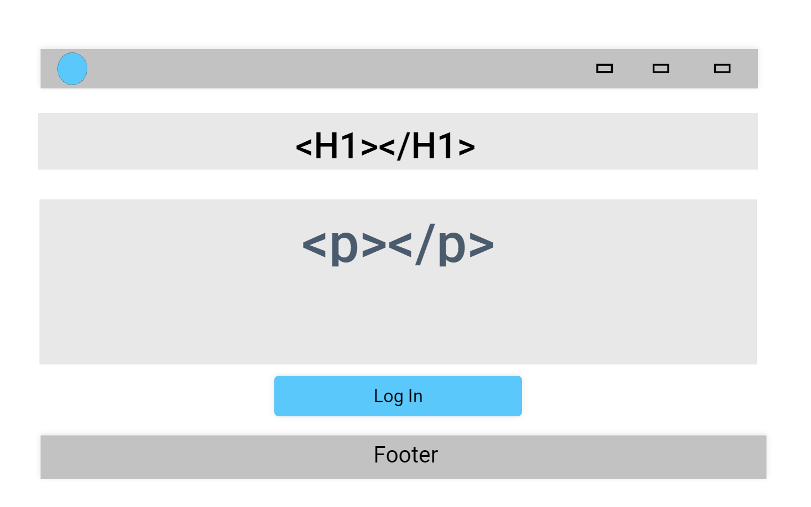

# Book Management and Commenting System

## User Experience (UX) Section

This rudimentary projects allows the final users to create, read, update and delete the entries regarding book title on a certain topic, creating a unique database. Additional value is the "comment" option, which serves as a discussion forum where the readers can share their thoughts. 
## Objective

This basic project enables end-users to create, read, update, and delete entries for book titles on specific topics, thereby establishing a unique database. An added feature is the "comment" option, providing a platform for readers to engage in discussions and share their thoughts.

## Users Benefits and Goals

- Customer
- Final User
#### A) For the first-time user

#### For returning and frequent users

### Design

**Landing Page**

**Data Management Page**

## Technologies Used ?
- HTML, CSS, Django 

## Software Resources Used
- [Uizard.io](https://app.uizard.io/ "uizard.io") was utilised for wireframing.
- [Faststone Image Viewer](https://www.faststone.org/ "Faststone Image Viewer") was utilised for image resizing and photo editing.
- [Markdown Editor](https://markdown-editor.github.io/ "Markdown Editor")
- Git Version control was managed using Git, with commits executed via the Gitpod terminal and pushes directed to GitHub.
- GitHub The project's code is stored on GitHub after being pushed from Git.
- ? "Projects", "Milestones" and "Issues" functions inbeded in GitHub utilized to apply AGILE concepts
- [ElephantSQL](https://www.elephantsql.com/ "ElephantSQL PostgreSQL databases").
- [HEROKU](https://www.heroku.com/ "HEROKU cloud platform") used to deploy and manage the applications.

## Learning Resources Used

- [Bob's Programming Academy](https://www.youtube.com/watch?v=EUMpUUXKvP0&t=3091s/ "Bob's Programming Academy") outshaped the basic idea of this project and source for some code sections.

## Testing and debugging

- [W3C Markup Validator](https://validator.w3.org/ "W3C Markup Validator")
- [W3C CSS Validator](https://jigsaw.w3.org/css-validator/#validate_by_input "W3C CSS Validator")

## Deployment

- This web project is a part of [Code Institute](https://learn.codeinstitute.net/ci_program/diplomainfullstacksoftwarecommoncurriculum "Code Institute") learning activities.
- Author: Dr. Vladimir Aleksic
- Contact Details: vladimiraleksic.nis@gmail.com
- Licence: Creative Commons

## Testing User Stories from the UX Section

#### First-Time Visitor Goals
#### Returning and Frequent Visitor Goals
### Further Testing
### Known Bugs